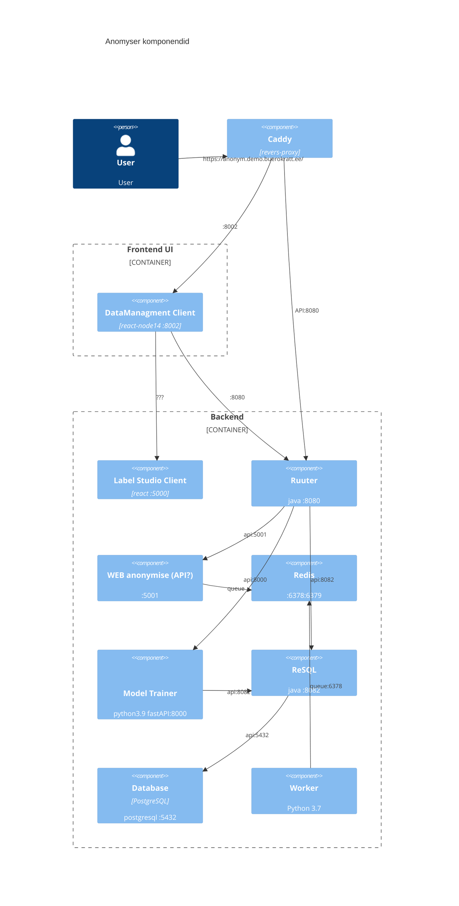

# Anonümiseerija ülevaade

## Komponendid

```mermaid
    C4Component
      title Anomyser komponendid

      Person(user, User, "User")

      Component(proxy,"Caddy","revers-proxy","")

        Container_Boundary(front,"Frontend UI"){
            Component(dmclient,"DataManagment Client","react-node14 :8002")
        }

        Container_Boundary(backend, "Backend","Backend services") {
            Component(lsclient,"Label Studio Client","react :5000")
            Component(ruuter, "Ruuter", "", "java :8080")
            Component(web, "WEB anonymise (API?)", "", ":5001")
            Component(redis, "Redis", "", ":6378:6379")
            Component(mlservice, "Model Trainer", "", "python3.9 fastAPI:8000","This application is intended for handling the training of the NER model used in RIA anonymizer")
            Component(resql, "ReSQL", "", "java :8082")
            Component(db, "Database", "PostgreSQL", "postgresql :5432")
            Component(worker, "Worker", "", "Python 3.7")

            Rel(ruuter, resql, "api:8082")
            Rel(ruuter, web, "api:5001")
            Rel(ruuter, mlservice, "api:8000")
            Rel(resql, db, "api:5432")
            Rel(worker,redis,"queue:6378")
            Rel(web,redis,"queue")
            Rel(mlservice, resql, "api:8082")
        }

    Rel(user,proxy,"https://anonym.demo.buerokratt.ee/")
    Rel(proxy,dmclient,":8002")
    Rel(proxy,ruuter,"API:8080")
    Rel(dmclient,lsclient,"???")
    Rel(dmclient,ruuter,":8080")

    UpdateLayoutConfig($c4ShapeInRow="4", $c4BoundaryInRow="1")
```
> Lahtiütlus: Vajab üle vaatamist. Arhitektuuri ülevaade on pöördprojekteeritud dockeri, konfiguratsiooni ja lähtefailide põhjal.

## 
