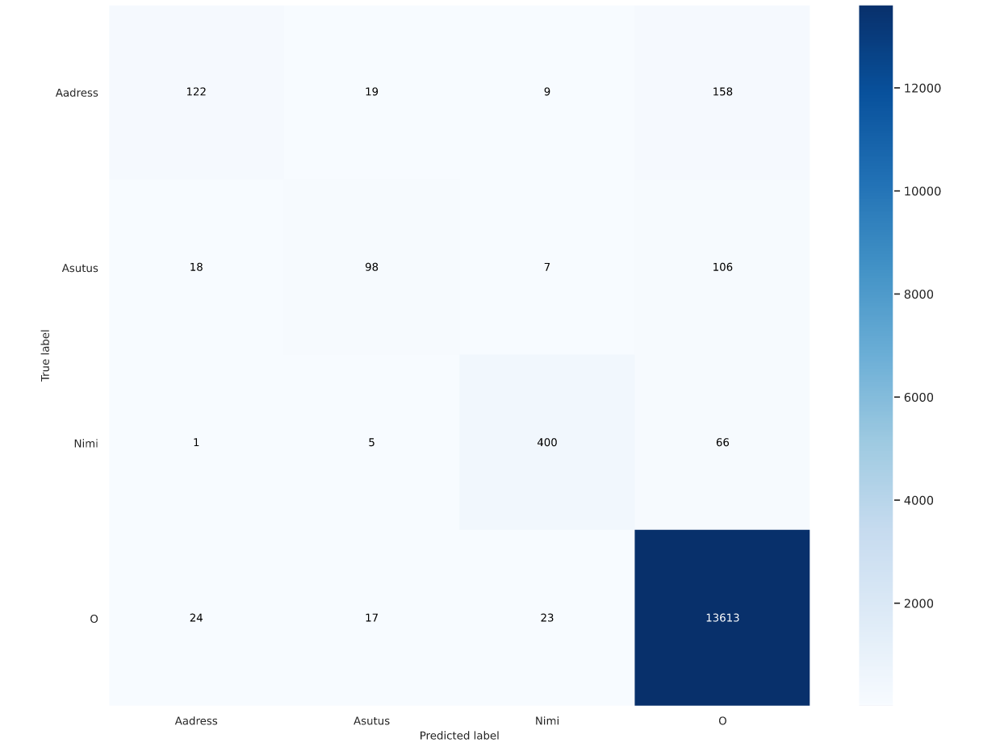
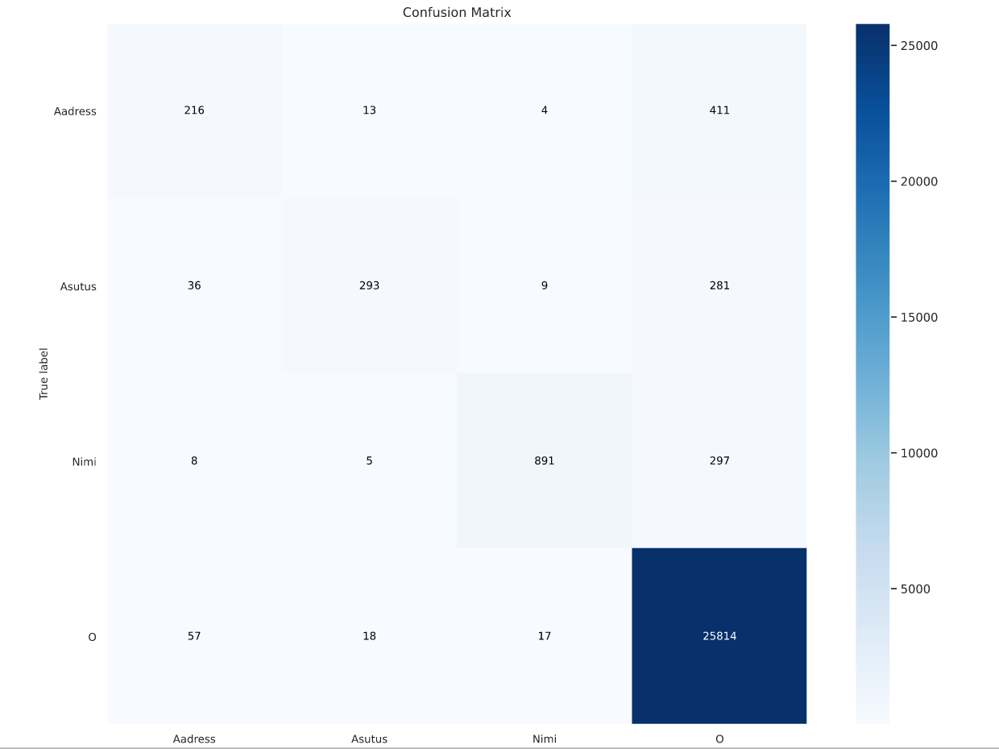
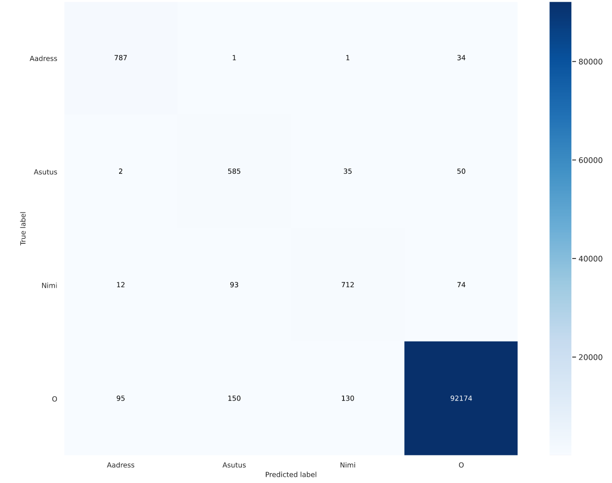

### Evaluation results 
Results using Estonian new NER dataset. 
<pre>

processed 14686 tokens with 715 phrases; found: 465 phrases; correct: 342.
accuracy:  57.68%; (non-O)
accuracy:  96.66%; precision:  73.55%; recall:  47.83%; FB1:  57.97
          Aadress: precision:  60.19%; recall:  23.31%; FB1:  33.60  103
           Asutus: precision:  50.00%; recall:  30.67%; FB1:  38.02  92
             Nimi: precision:  86.67%; recall:  78.26%; FB1:  82.25  270
</pre>

Covered entities: 
<pre>
processed 14686 tokens with 715 phrases; found: 479 phrases; correct: 408.
accuracy:  67.29%; (non-O)
accuracy:  97.32%; precision:  85.18%; recall:  57.06%; FB1:  68.34
          Aadress: precision:  79.69%; recall:  38.35%; FB1:  51.78  128
           Asutus: precision:  76.47%; recall:  43.33%; FB1:  55.32  85
             Nimi: precision:  90.60%; recall:  80.60%; FB1:  85.31  266
</pre>

Results using Estonian old NER dataset. 
<pre>
processed 28370 tokens with 1851 phrases; found: 986 phrases; correct: 799.
accuracy:  53.94%; (non-O)
accuracy:  95.68%; precision:  81.03%; recall:  43.17%; FB1:  56.33
          Aadress: precision:  60.09%; recall:  22.43%; FB1:  32.67  218
           Asutus: precision:  74.37%; recall:  34.66%; FB1:  47.28  199
             Nimi: precision:  91.39%; recall:  61.90%; FB1:  73.81  569
</pre>

Covered entities: 
<pre>
processed 28370 tokens with 1851 phrases; found: 1022 phrases; correct: 900.
accuracy:  59.86%; (non-O)
accuracy:  96.19%; precision:  88.06%; recall:  48.62%; FB1:  62.65
          Aadress: precision:  74.44%; recall:  28.42%; FB1:  41.14  223
           Asutus: precision:  82.03%; recall:  41.69%; FB1:  55.28  217
             Nimi: precision:  95.53%; recall:  66.19%; FB1:  78.20  582
</pre>

Results on elisa test dataset: 
<pre>
processed 94935 tokens with 1633 phrases; found: 1785 phrases; correct: 1306.
accuracy:  86.30%; (non-O)
accuracy:  99.26%; precision:  73.17%; recall:  79.98%; FB1:  76.42
          Aadress: precision:  72.80%; recall:  80.98%; FB1:  76.67  386
           Asutus: precision:  67.31%; recall:  84.87%; FB1:  75.08  725
             Nimi: precision:  79.67%; recall:  75.53%; FB1:  77.55  674
</pre>

Output covered entities results: 

<pre>
processed 94935 tokens with 1633 phrases; found: 1800 phrases; correct: 1465.
accuracy:  93.38%; (non-O)
accuracy:  99.44%; precision:  81.39%; recall:  89.71%; FB1:  85.35
          Aadress: precision:  77.40%; recall:  85.88%; FB1:  81.42  385
           Asutus: precision:  78.42%; recall:  91.65%; FB1:  84.52  672
             Nimi: precision:  86.14%; recall:  90.01%; FB1:  88.03  743
</pre>

Results on Ria dataset (test set): 

<pre>
processed 31371 tokens with 2124 phrases; found: 2339 phrases; correct: 1746.
accuracy:  85.20%; (non-O)
accuracy:  97.21%; precision:  74.65%; recall:  82.20%; FB1:  78.24
             DATE: precision:  60.80%; recall:  71.33%; FB1:  65.64  176
            EVENT: precision:  47.83%; recall:  65.67%; FB1:  55.35  92
              GPE: precision:  84.21%; recall:  87.11%; FB1:  85.63  361
              LOC: precision:  59.13%; recall:  60.18%; FB1:  59.65  115
            MONEY: precision:  24.24%; recall:  57.14%; FB1:  34.04  33
              ORG: precision:  72.19%; recall:  78.04%; FB1:  75.00  320
              PER: precision:  93.42%; recall:  93.71%; FB1:  93.56  638
          PERCENT: precision:  72.73%; recall:  88.89%; FB1:  80.00  22
             PROD: precision:  51.94%; recall:  62.21%; FB1:  56.61  206
             TIME: precision:  46.67%; recall:  63.64%; FB1:  53.85  30
            TITLE: precision:  72.54%; recall:  87.46%; FB1:  79.30  346

</pre>

## Confusion matrix 

### Results on New NER dataset

### Results on Old NER dataset 

### Results on Elisa test dataset (finetuned)
